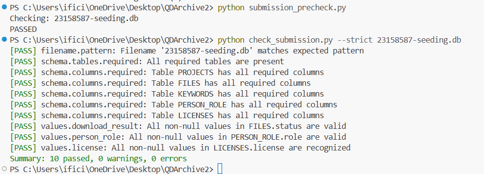

# QDArchive Seeding Project — Part 1: Data Acquisition

## Author

* **Name:** Md Ikram Tareq
* **Student ID:** 23158587
* **University:** Friedrich-Alexander-Universität Erlangen-Nürnberg (FAU)
* **Supervisor:** Prof. Dr. Dirk Riehle

---

## Project Overview

This project is part of the **Seeding QDArchive initiative**, aiming to build an automated pipeline for collecting qualitative research datasets from public repositories.

The system:

* Searches repositories using qualitative and QDA-specific queries
* Downloads publicly available dataset files
* Extracts structured metadata
* Stores all data in a normalized SQLite database
* Logs all download outcomes (success + failure)

This serves as a **foundation for QDArchive**, a future platform for qualitative data sharing.

---

## Data Sources

| # | Repository                        | URL                              | Method                  |
| - | --------------------------------- | -------------------------------- | ----------------------- |
| 1 | QDR (Qualitative Data Repository) | https://qdr.syr.edu/             | Dataverse API           |
| 2 | CESSDA Data Catalogue             | https://datacatalogue.cessda.eu/ | OAI-PMH + HTML crawling |

---

## Search Strategy

### General Queries

* qualitative
* qualitative research
* interview
* focus group
* ethnography

### QDA-Specific Queries

* qdpx
* nvivo / nvpx
* maxqda / mqda

These queries aim to identify datasets containing **qualitative data analysis (QDA) files**.

---

## Pipeline Architecture

### QDR Pipeline

* Uses Dataverse API (`/search`, `/datasets`)
* Extracts metadata from `latestVersion`
* Downloads dataset files and documentation

### CESSDA Pipeline

* Uses OAI-PMH (`ListRecords`)
* Extracts metadata (title, DOI, contributors, etc.)
* Enhances with HTML crawling and link extraction
* Attempts downloads from publisher pages

---

## Database Schema

SQLite Database: `23158587-seeding.db`

| Table         | Description                           |
| ------------- | ------------------------------------- |
| `projects`    | Dataset-level metadata                |
| `files`       | File-level metadata + download status |
| `keywords`    | Project keywords                      |
| `person_role` | Authors and contributors              |
| `licenses`    | License information                   |

### File Status

* `SUCCEEDED` → File successfully downloaded
* `FAILED_LOGIN_REQUIRED` → Access restricted (authentication required)
* `FAILED_SERVER_UNRESPONSIVE` → Broken link or server issue
* `FAILED_TOO_LARGE` → File too large to download

---

## Results

| Metric                 | Value |
| ---------------------- | ----- |
| **Projects processed** | 62    |
| **Files recorded**     | 4,087 |
| **Keywords extracted** | 352   |
| **Persons recorded**   | 156   |
| **Licenses recorded**  | 62    |

---

## File Types

### Target QDA Files

* `.qdpx`, `.nvpx`

### Downloaded Data Types

* `.pdf`, `.txt`, `.csv`, `.xlsx`, `.zip`, `.json`, `.xml`

---

## Key Limitations

### 1. Restricted Data Access

* Majority of files require authentication
* Large portion marked as `FAILED_LOGIN_REQUIRED`

### 2. CESSDA Constraints

* Mainly provides metadata
* External links often require login or are not directly downloadable

### 3. Lack of QDA Files

* No QDA project files found
* Indicates limited sharing of analysis-level data

### 4. High Failure Rate

* Only a small percentage of files successfully downloaded
* Most failures due to access restrictions

---

## Key Findings

* QDA files are **extremely rare** in public repositories
* Most accessible files are **documentation (PDF, text, metadata)**
* **Access restriction is the dominant barrier**
* Public datasets rarely include analysis-ready formats
* Metadata quality varies significantly

---

## Technical Challenges & Solutions

| Challenge                   | Solution                              |
| --------------------------- | ------------------------------------- |
| Duplicate datasets          | Deduplication using `project_url`     |
| Inconsistent licenses       | License normalization                 |
| Restricted files            | Classified as `FAILED_LOGIN_REQUIRED` |
| Missing file links (CESSDA) | HTML crawling + link extraction       |
| Invalid downloads           | Content validation (avoid HTML pages) |

---

## How to Run

```bash
# Run full pipeline
python -m src.run_all

# Export results to CSV
python -m src.csv_export
```

---

## Project Structure

```
QDArchive/
│
├── src/
├── validator/
├── schema-definition/
├── submission_precheck.py
├── check_submission.py
├── 23158587-seeding.db
├── validation_result.png
├── README.md
└── requirements.txt
```

---

## Data Availability

### SQLite Database

* `23158587-seeding.db` (included in repository root)


### External Access (FAUbox)

The downloaded dataset files are available here:

* FAUbox: https://faubox.rrze.uni-erlangen.de/getlink/fi8WYA43xBQzfHh3tJ5D6v/my_downloads

---

## SQ26 Validation Result

The SQLite database was validated using the official SQ26 submission validator.

**Command used:**

```bash
python check_submission.py --strict 23158587-seeding.db
```

**Validation Output:**



**Summary:**

* ✔ 10 checks passed
* ✔ 0 warnings
* ✔ 0 errors

This confirms that the database fully complies with the required SQ26 schema and validation rules.

---

## Conclusion

This project demonstrates:

* A working **data acquisition pipeline** for qualitative research
* Integration of **API + OAI-PMH sources**
* Structured storage of metadata and files
* Transparent handling of access limitations

Despite constraints, it provides a **solid foundation for building QDArchive**.
